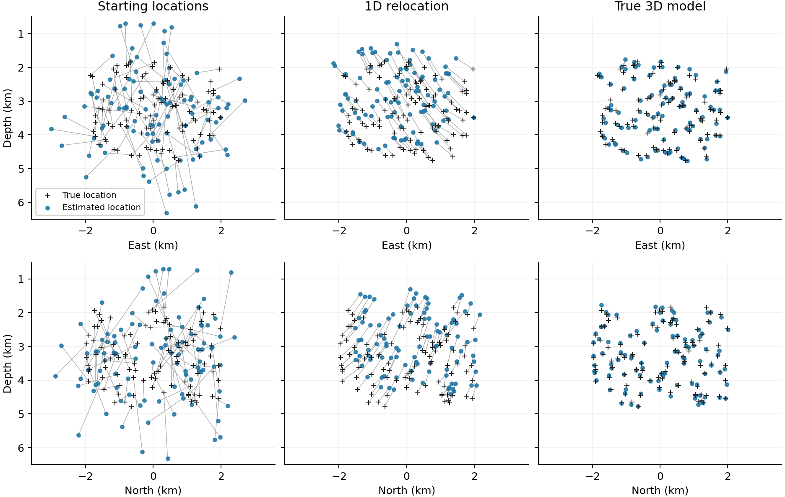

# Small 3D relocation example

Run from the repository root with Julia 1.10 or later:

```bash
julia --project=. examples/three_dimensional/run_synthetic.jl
```

No external Julia packages are needed. The script writes all inputs, two complete
run configurations and results to `generated/`. Give a different output directory
as its first argument if required. Rerunning in the same directory replaces this
example's generated inputs and results; it does not touch other case studies.

The model has a depth-dependent background velocity and smooth lateral positive
and negative anomalies. Its relief varies across the network. There are 100
hypocenters at 1.8–4.8 km depth, recorded at eight stations in P and S. Receivers
are placed 0.1 m below the sampled terrain at horizontal nodes shared by both
grids, so roundoff in station coordinates cannot put them just above the DEM.
The travel-time calculation excludes nodes above the surface.

Data are generated on a **150 m grid**, with independent Gaussian noise of
8 ms added to each station–phase/event arrival potential before differencing.
These are synthetic synchronized potentials, not the output of a DDSync denoising
experiment. Starting locations have 600 m standard deviation in each horizontal
coordinate and 900 m in depth. One reference event is fixed at its true location
in both runs. Origin-time updates have zero mean.

The first run uses regular GraphSplit's 1D lookup builder with the correct
background profile, without lateral anomalies. The second uses the prescribed
3D model sampled on a **300 m grid**. Both use the same inputs, solver settings,
reference event and graph-construction rules. The final event-pair graphs can
differ because Stage 1 gives different locations. This is a known-model test:
it does not represent uncertain field velocities, incomplete phase coverage or
the relative performance of different relocation programs.

A run on 9 October 2026, Julia 1.12.3, gave the following RMS location errors for
all 100 events, including the reference event:

| Catalog | Horizontal (m) | Depth (m) | 3D distance (m) |
| --- | ---: | ---: | ---: |
| Starting locations | 854.3 | 990.6 | 1308.1 |
| 1D relocation | 429.5 | 445.0 | 618.4 |
| True 3D model | 42.2 | 74.1 | 85.3 |

The comparison shows recovery with a known 3D model and a separate, finer
synthetic-data grid. It is not a validation of the default 500 m spacing for
field use. Numerical tests also check homogeneous-model refinement, refraction
across a horizontal velocity interface, topography, binary grid formats,
interpolated derivatives, cache invalidation and memory-limit refusal.



Black crosses are true locations; blue points are starting or relocated locations.
Connecting lines show their displacement. All panels use the same limits and
equal horizontal/depth scale. Both projections include every event.

## Files to inspect

- `generated/one_dimensional.toml` and `generated/three_dimensional.toml`: complete
  run settings, with paths relative to these files.
- `generated/truth.txt`, `catalog.txt`, `stations.txt`, `vm.txt`, `theta/` and
  `thetastd/`: the truth, starting catalog, network and observations.
- `generated/vp.hdr/.buf`, `vs.hdr/.buf`, `surface.txt`: NLL-format velocity
  volumes and terrain grid. These deliberately use local coordinates with an
  explicit geographic origin in the TOMLs.
- `generated/output_one_dimensional/` and `output_three_dimensional/`: standard
  GraphSplit outputs, including catalogs and solver histories.
- `generated/metrics.toml` and `*_errors.csv`: aggregate and event-level errors.
- `generated/lookuptable/`: reproducible travel-time caches, not required inputs.

The optional `plot_comparison.py` recreates the figure above from the error CSVs
and needs NumPy and Matplotlib. The relocation example itself needs only Julia.
Elapsed times in the metrics file describe that particular execution, including
any table building; caches and compilation state affect them. They are not a
controlled speed benchmark.
